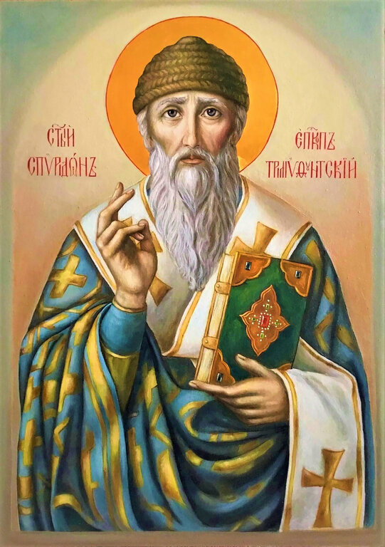

<h1 align="center">
  <a href="https://st-spyridon-foundation.com">
    st-spyridon-foundation.com
  </a>
</h1>

A website for the __*"St. Spyridon, Wonderworker of Trimitunt" Foundation*__,

> Recorded in the commercial register of Bulgaria as __*Фондация "Св. Спиридон Тримитунтски Чудотворец"*__
 
whose aim is the construction of Оrthodox church 
named after the saint in "Studentski grad" in Sofia, Bulgaria, 
which will be helping the neighbor and the needy.
